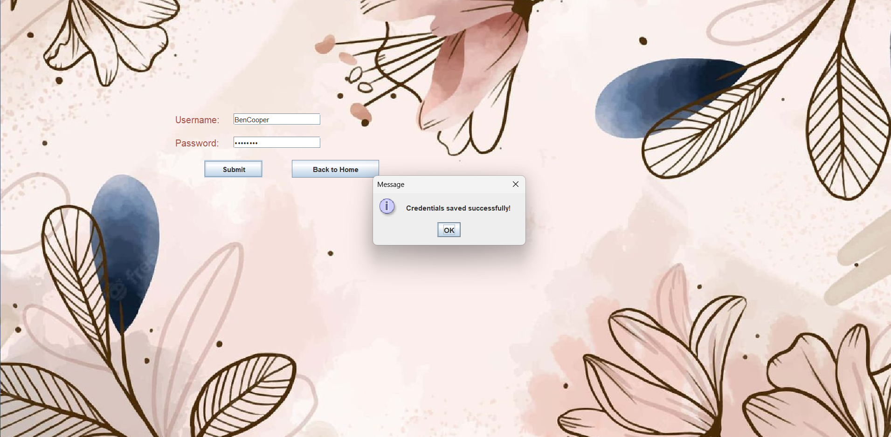
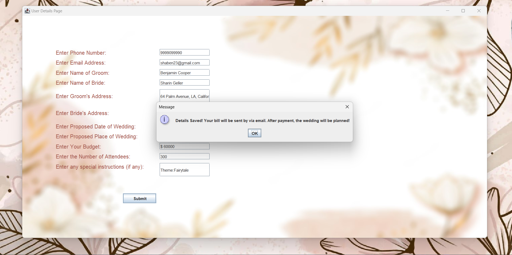
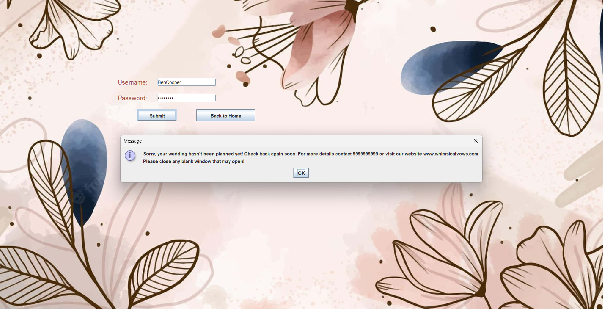

# wedding-planner

Welcome to the wedding-planner project created as part of a mini-project for the Semester 2 of the BS-MS Course at the Indian Association for the Cultivation of Science, Kolkata.

This project was first created as a Command Line Program as seen in the file **Main.java** but was later upgraded to have a fully functional Graphical User Interface via Swing (Java).

To run this program as a GUI, download all the files and navigate into the folder containing the file **WeddingPlanner.java** and open **Windows Terminal**. Type the following into the terminal:

`javac WeddingPlanner.java`

and press Enter. Then type the following into the terminal:

`java WeddingPlanner`

The following window will open

###For a First-time User

Click on the **New User Registration** button.

Click on the **Sign Up** button, create a Username & Password and click on **Submit**

Your credentials will be saved.

###After Registration

Go to the Homepage and click on **Existing User Login** button. Fill up your credentials and login.

Fill up the required details and click on **Submit**. You will get a confirmation.

###To Check whether Event has been Planned

Use the **Existing User Login** again and login to check whether the event has been planned.

If it has not been planned, you will get the following message

On the other hand, if it has been planned, you will be shown the detailed plan.

------------

##  How It Works
Let us create a Username: **BenCooper** and Password: **benjamin**

During the first time **Sign Up**, it creates a file **BenCooper.txt** where it stores the Username and Password.

This is checked with the provided Username & Password during **Existing User Login**.

The details that the user inputs are saved in a file named **BenCooper_details.txt**.

The program checks if the event has been planned by checking the existence of a file named **BenCooper_plan.txt**. 

The planner on the backend must write his plan and save it as **BenCooper_plan.txt**  in the same folder.

The entries of this file is shown in the program.